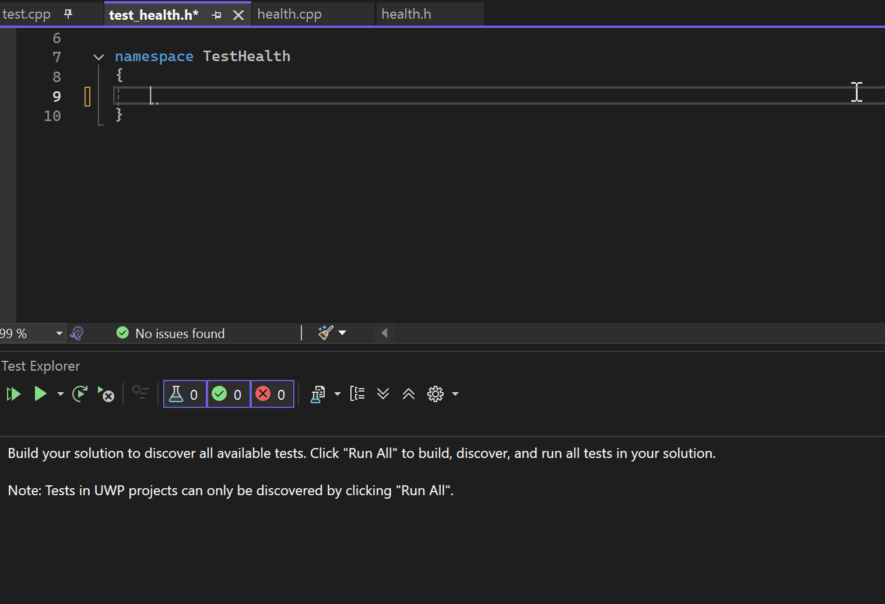

# Test Adapter for Doctest
Free open source Visual Studio Test Adapter VSIX to search, list, run and debug C++ [doctest](https://github.com/doctest/doctest) unit tests. Implemented using the Microsoft Test Adapter framework [vstest](https://github.com/microsoft/vstest).  

| main branch | dev branch |
|--|--|
|  |  |  

## 🖥️ Features
* Visual Studio Test Adapter to run and debug C++ doctest unit tests.
* Custom settings for test discovery and execution.
* Exe and DLL support.  

| IDE | Test Discovery | Test Execution | Test Debug |
|---|---|---|---|
| Visual Studio Community 2022 | ✅ | ✅ | ✅ |
| Visual Studio Professional 2022 | ✅ | ✅ | ✅ |
| Visual Studio Enterprise 2022 | ✅ | ✅ | ✅ |  

## 📖 Documentation
Visit the [wiki](https://github.com/comfyjase/DoctestTestAdapter/wiki) for more information.

## 🧪 Test Coverage
This repository has unit tests in the `DoctestTestAdapter.Tests` and `DoctestTestAdapter.Tests.Godot` projects so developers can quickly test their own code changes locally and make sure everything passes before making any commits.
There is also [continuous integration](https://github.com/comfyjase/DoctestTestAdapter/actions/workflows/ci.yml) setup for both main and dev branches as well as pull requests to help ensure stability throughout development.  

## 🛠️ Contributing
🗣️ Feel free to head over to the discussions to ask questions and share ideas [here](https://github.com/comfyjase/DoctestTestAdapter/discussions).  
🐛 If you notice a bug please report it using this form [here](https://github.com/comfyjase/DoctestTestAdapter/issues/new?template=bug_report.yml).  
💡 For suggesting improvements please fill out this form [here](https://github.com/comfyjase/DoctestTestAdapter/issues/new?template=feature_proposal.yml).  
🔎 You can create pull requests for bug fixes or new features for review.  

## 📃 License
Test Adapter for Doctest is licensed under the [MIT License](./LICENSE.txt).

## 🙌 Thank you!
